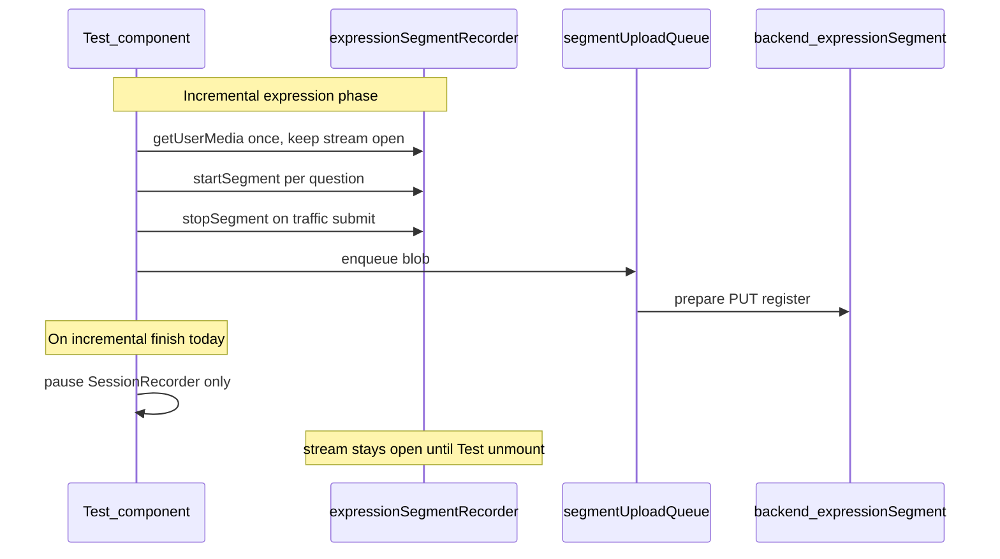
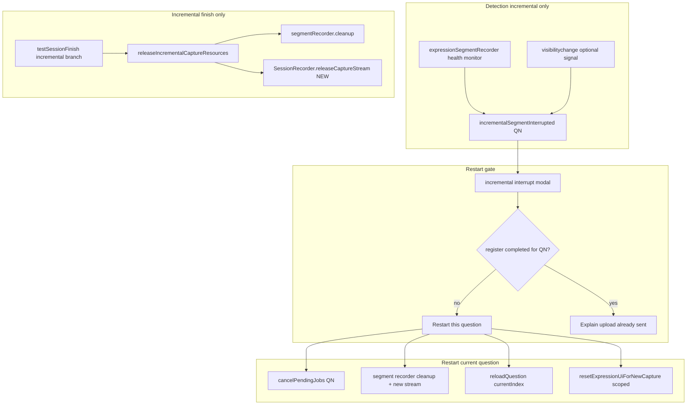

# Incremental mic release and call-interruption recovery

## Goals (incremental mode only)

1. **Release mic at end of test** — mirror legacy’s track teardown so incremental does not leave `expressionSegmentRecorder` + `SessionRecorder` streams open on the summary screen.
2. **Detect interruption** during an expression question (phone call, `track ended`, `MediaRecorder` inactive) on the **segment** path.
3. **User-initiated restart** of **only the current question**, and **only if** that question’s segment has **not** been successfully registered on the server (`registerExpressionSegment` completed).
4. **Protect the upload queue** — other questions’ pending/in-flight jobs continue; only cancel pending jobs for the restarted question number.
5. **Zero behavior change** on the legacy finish path ([`testSessionFinish.js`](frontend_demo/js/test/finish/testSessionFinish.js) lines 200+).

## Non-goals

- Changing legacy `stopContinuousRecording` / full-session MP3 pipeline.
- Reusing or extending the existing `recordingInterruptedBanner` (SessionRecorder) for incremental UX — keep that banner and its callbacks **unchanged** for legacy parity.
- Auto-restart without user confirmation (mobile needs a tap after call; also matches your “let the user know” requirement).

---

## Current state (why this is needed)

- Legacy finish calls [`stopContinuousRecording()`](frontend_demo/js/record_session/recordingCapture.js) and stops tracks.
- Incremental success path in [`testSessionFinish.js`](frontend_demo/js/test/finish/testSessionFinish.js) (lines 154–197) never stops segment or session capture streams.
- [`expressionSegmentUploadQueue.js`](frontend_demo/js/test/expression/expressionSegmentUploadQueue.js) has no per-question cancel or “upload completed” tracking.
- Backend [`upsert_expression_segment`](backend/MongoDB.py) is idempotent by `questionNumber` (safe for a future re-upload), but your rule correctly avoids restart **after** a successful register to prevent unscored / ambiguous AI state.

---

## Architecture (incremental-only modules)

---

## Implementation plan

### 1. Release mic at incremental finish (legacy parity, incremental-only caller)

**Add** a narrow API on the session recorder side (preferred over calling full `stopContinuousRecording` from incremental, which triggers final MP3 encode/wait):

- New function in [`recordingCapture.js`](frontend_demo/js/record_session/recordingCapture.js) + export via [`recording.js`](frontend_demo/recording.js): e.g. `releaseCaptureStream()` — stop audio tracks, clear `state.stream`, set recorder inactive flags, **do not** start `beginFinalBlobReadyWait` / MP3 conversion.
- **Legacy finish** continues to call only `stopContinuousRecording()` (unchanged line in `testSessionFinish.js`).

**Call site (incremental only):** in [`testSessionFinish.js`](frontend_demo/js/test/finish/testSessionFinish.js), inside the incremental success branch (before or after `setSessionCompleted(true)`):

- `expressionSegmentRecorderRef.cleanup()` (expose on finish ctx from [`test.js`](frontend_demo/js/test/test.js))
- `SessionRecorder.releaseCaptureStream()` if available

Also call the same helper from incremental **fallback** path if it later finishes without segments (optional, still incremental branch only).

### 2. Segment health monitor (incremental-only)

Extend [`expressionSegmentRecorder.js`](frontend_demo/js/record_session/expressionSegmentRecorder.js):

- `attachStreamHealthMonitor()` on the segment `getUserMedia` stream (`track.onended` → callback).
- `checkHealth()` → `{ ok, reason }` (track `ended`, recorder `inactive` while segment should be active).
- `setOnInterrupted(cb)` / clear on `cleanup()`.
- Do **not** modify [`recordingCapture.js`](frontend_demo/js/record_session/recordingCapture.js) `attachStreamHealthMonitor` (legacy session path stays as-is).

Wire in [`test.js`](frontend_demo/js/test/test.js) **only when** `getExpressionAudioMode() === "incremental"`:

- On init incremental pipeline effect, register callback → set state e.g. `incrementalSegmentInterrupt` `{ questionNumber, reason }`.
- On `visibilitychange` → `visible`, if on expression question in incremental mode, run `checkHealth()` (call often kills the track without firing app pause).

### 3. Upload queue: per-question safety

Extend [`expressionSegmentUploadQueue.js`](frontend_demo/js/test/expression/expressionSegmentUploadQueue.js):

| API | Purpose |
|-----|---------|
| `cancelPendingForQuestion(qn)` | Remove queued jobs matching `questionNumber` (not the job currently uploading) |
| `isUploadInFlight(qn)` | `running` + current job’s `questionNumber === qn` |
| `hasCompletedUpload(qn)` | Set `completedQuestions` Set when `registerExpressionSegment` succeeds |
| `getQuestionUploadState(qn)` | `none` / `pending` / `in_flight` / `completed` / `failed` |

**Restart gate (your rule):** allow “Restart this question” only when `getQuestionUploadState(currentQ) !== "completed"`.

- If `in_flight`: show “Upload in progress—wait a moment” (no restart until idle for that Q or user dismisses).
- If `pending`: `cancelPendingForQuestion(qn)` then restart.
- If `completed`: show message that this answer was already sent; no restart (avoids unscored segment).

Other questions’ queue entries are untouched.

### 4. Restart current expression question (incremental-only)

New function in [`test.js`](frontend_demo/js/test/test.js) (or small module `js/test/expression/incrementalInterruptRecovery.js`):

`restartCurrentIncrementalExpressionQuestion()`:

1. Guard: incremental mode, expression question, `sessionCompleted` false, upload state not `completed` for current `query_number`.
2. `cancelPendingForQuestion(qn)` if pending.
3. If traffic already submitted for this question but upload not completed: revert **only this question** in `questionResults` (remove row, `adjustCountsForResult` undo) — **only** when upload not completed (per your rule, usually interrupted before submit; this covers edge “submitted but still in queue”).
4. `expressionSegmentRecorder.cleanup()` then lazy re-acquire stream on next `startSegment`.
5. Reuse patterns from [`resetExpressionUiForNewCapture`](frontend_demo/js/test/test.js) (timers/traffic popup) — **do not** call `clearExpressionRecordingForFreshCapture` (that resets SessionRecorder timestamps for whole expression section).
6. `loadQuestion(currentIndex)` to replay question audio and re-arm flow.
7. Clear interrupt modal state; clear incremental freeze ref if set.

**Do not** change [`restartExpressionAfterRefresh`](frontend_demo/js/test/test.js) (full expression-section restart).

### 5. UI (incremental-only overlay)

New overlay in [`testOverlays.js`](frontend_demo/js/test/ui/testOverlays.js) (or extend with `if (!incremental) return null` for legacy):

- Title/body i18n keys in [`i18n.js`](frontend_demo/js/core/i18n.js) (Hebrew + English).
- Primary: “Restart this question” → `restartCurrentIncrementalExpressionQuestion`.
- Secondary: “Continue anyway” / dismiss (if interrupted but user wants to try continuing — optional; default dismiss only).
- Show blocked state when upload already completed.

Keep existing [`renderRecordingInterruptedBanner`](frontend_demo/js/test/ui/testOverlays.js) **unchanged** (SessionRecorder / legacy).

### 6. Legacy isolation checklist (for Legacy Guardian subagent)

| File / path | Allowed change |
|-------------|----------------|
| `testSessionFinish.js` legacy branch (after line 199) | **No edits** |
| `recordingCapture.stopContinuousRecording` behavior | **No edits** |
| `checkExpressionRecordingHealth` / `setOnRecordingInterrupted` wiring | **No edits** |
| Incremental branch in `testSessionFinish.js` | Add `releaseIncrementalCaptureResources` only |
| `expressionSegmentRecorder.js`, `expressionSegmentUploadQueue.js` | Incremental-only consumers |
| New `releaseCaptureStream` | New export; legacy callers must not use it unless incremental finish |

---

## Edge cases (call / OS)

| Scenario | Behavior |
|----------|----------|
| Call during 20s window, before submit | Detect → modal → restart allowed (no server register) |
| Call after submit, job **pending** in queue | Cancel pending job for Q → restart allowed |
| Call after submit, job **in flight** | Modal: wait; poll until idle/failed then allow restart or dismiss |
| Call after **register** succeeded | Modal: explain already sent; **no** restart |
| Call while other questions uploading | Only current Q affected; queue continues for others |
| Interrupt on comprehension (הבנה) | No incremental segment monitor action |
| User on summary (`sessionCompleted`) | No restart; release mic already ran at finish |
| Pause / clapping / incremental upload freeze | Do not treat as segment interrupt; existing freeze logic unchanged |
| SessionRecorder track dies but segment OK | Rare; incremental modal from segment monitor only (do not change legacy banner) |
| Double restart tap | Idempotent guards + `expressionEvalArmedQuestionRef` reset via `loadQuestion` |

---

## Multi-agent execution model

| Role | Responsibility |
|------|----------------|
| **Coordinator** | Owns scope, merges PR, ensures incremental gates on all new code paths |
| **Legacy Guardian** | Review diff: zero changes to legacy finish path and SessionRecorder interrupt banner; approve only additive `releaseCaptureStream` |
| **Implementer (frontend)** | Items 1–5 above |
| **QA** | Manual matrix on phone + desktop, incremental vs legacy smoke |

**QA matrix (minimum):**

- Legacy test end → mic released, no new modals, finish unchanged.
- Incremental test end → both streams released; summary works.
- Incremental: interrupt before submit → restart → new segment uploads once.
- Incremental: submit then kill mic before upload completes → restart after cancel pending.
- Incremental: submit and wait for upload complete → restart blocked.
- Incremental: Q4 uploading, interrupt on Q5 before submit → Q4 upload completes, Q5 restarts only.

---

## Changelog

Append to [`changes/CHANGES_2026-05-28_28.md`](changes/CHANGES_2026-05-28_28.md): incremental mic release at finish, segment interrupt detection, queue-safe per-question restart (blocked after server register).

---

## Files touched (expected)

- [`frontend_demo/js/record_session/recordingCapture.js`](frontend_demo/js/record_session/recordingCapture.js) — add `releaseCaptureStream` (additive)
- [`frontend_demo/recording.js`](frontend_demo/recording.js) — export
- [`frontend_demo/js/record_session/expressionSegmentRecorder.js`](frontend_demo/js/record_session/expressionSegmentRecorder.js) — health monitor
- [`frontend_demo/js/test/expression/expressionSegmentUploadQueue.js`](frontend_demo/js/test/expression/expressionSegmentUploadQueue.js) — per-question state + cancel
- [`frontend_demo/js/test/test.js`](frontend_demo/js/test/test.js) — wire monitor, restart, finish ctx
- [`frontend_demo/js/test/finish/testSessionFinish.js`](frontend_demo/js/test/finish/testSessionFinish.js) — incremental branch only
- [`frontend_demo/js/test/ui/testOverlays.js`](frontend_demo/js/test/ui/testOverlays.js) + [`frontend_demo/js/core/i18n.js`](frontend_demo/js/core/i18n.js) — modal copy
- Optional: [`frontend_demo/README.md`](frontend_demo/README.md) — short incremental interrupt note
