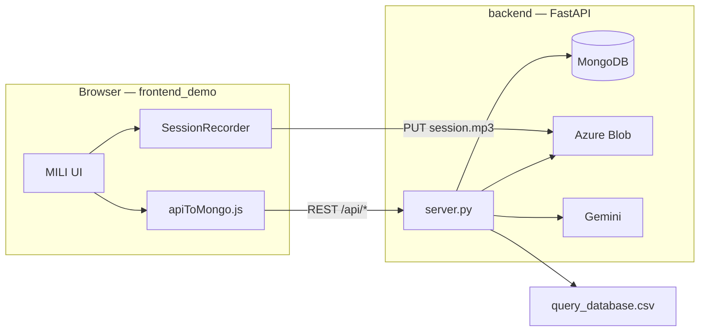

# MILI (See&Say)

**MILI** (מיל"י) is a browser-based language game for children: onboarding, age-tailored comprehension and expression questions, one continuous session recording, and a results screen with optional AI feedback on expressive answers.

This repository holds the **web demo** (`frontend_demo/`) and the **API** (`backend/`). The git repo is still named `seeandsay`; production API host is `seeandsay-backend.onrender.com`. User-facing branding is **MILI**; storage keys and infra names were kept for compatibility.

---

## Repository map

| Folder | Role |
|--------|------|
| **[`frontend_demo/`](frontend_demo/)** | **Deployable web app** — React (CDN), no bundler; loads via [`index.html`](frontend_demo/index.html). Questions, images, audio, CSS, and all client logic. |
| **[`backend/`](backend/)** | **FastAPI API** — users, tests, Azure session audio, MongoDB, Gemini expression scoring. Entry: `uvicorn server:app`. |
| **[`changes/`](changes/)** | **Engineering log** — dated `CHANGES_*.md` plus [`changes/docs/`](changes/docs/) for historical notes and archived backend audits. |
| **[`.github/`](.github/)** | CI / GitHub Pages workflow (if enabled for your fork). |
| **[`.cursor/`](.cursor/)** | Editor rules and agent skills (optional for contributors). |
| **`docs/plans/`** | Local planning artifacts (not part of runtime). |

**Not in this repo (separate):**

- **Content dashboard** — desktop Tkinter app for editing `query_database.csv` and images; syncs to [seeandsay-resources](https://github.com/almoggiat/seeandsay-resources). Copy updated assets into `frontend_demo/resources/`.
- **Legacy trees** — old `frontend/` copies were removed; deploy **only** `frontend_demo/`.

---

## How the pieces fit together



1. **Onboarding** — child profile, consents, mic check → `POST /api/createUser`.
2. **Test** — questions from CSV; continuous recording with per-question timestamps.
3. **Finish** — `prepareUpload` → upload MP3 to Azure → `addTestToUser` with scores and timestamps.
4. **Background** — server runs expression AI (Gemini) on audio segments.
5. **Summary** — client polls `GET /api/expressionAiStatus` for scores and Hebrew impression text.

---

## Quick start (local)

### 1. Frontend

From the **repo root**:

```bash
python -m http.server 8000
```

Open **`http://localhost:8000/frontend_demo/`** (trailing slash matters).

### 2. Backend

```bash
cd backend
python -m venv .venv
.\.venv\Scripts\activate          # Windows
pip install -r requirements.txt
# Create backend/.env (MongoDB, Azure SAS, GEMINI_API_KEY — see team)
uvicorn server:app --reload --port 8001
```

On localhost, [`apiToMongo.js`](frontend_demo/js/api/apiToMongo.js) uses port **8001** when the page is served from **8000**.

### 3. Smoke check

- Login → start test → finish session → summary shows AI status progressing.
- Network tab: `createUser`, `prepareUpload`, blob PUT, `addTestToUser`, `expressionAiStatus` return 200.

---

## Documentation index

| Area | Start here |
|------|------------|
| **Whole demo (UI)** | [`frontend_demo/README.md`](frontend_demo/README.md) |
| Frontend layout & load order | [`frontend_demo/docs/STRUCTURE.md`](frontend_demo/docs/STRUCTURE.md) |
| Test module map | [`frontend_demo/docs/TEST_MODULE_MAP.md`](frontend_demo/docs/TEST_MODULE_MAP.md) |
| **API** | [`backend/docs/BACKEND_MODULE_MAP.md`](backend/docs/BACKEND_MODULE_MAP.md) |
| Backend layout & rules | [`backend/docs/BACKEND_STRUCTURE.md`](backend/docs/BACKEND_STRUCTURE.md) |
| SMS + token results | [`backend/docs/SMS_RESULTS.md`](backend/docs/SMS_RESULTS.md) |
| Recent engineering changes | [`changes/CHANGES_2026-05-21_22-05.md`](changes/CHANGES_2026-05-21_22-05.md) |

---

## `frontend_demo/` at a glance

| Path | Purpose |
|------|---------|
| `index.html` | Script load order (treat as public API) |
| `js/app/` | Shell, welcome flow, routing |
| `js/test/` | Game orchestrator (`test.js`) + modules (`utils/`, `flow/`, `scoring/`, `ui/`, `finish/`) |
| `js/api/` | HTTP client to backend |
| `js/record_session/` | Continuous recorder (loaded via `recording.js`) |
| `resources/` | `query_database.csv`, images, question audio, avatar video |
| `css/screens/` | Per-screen styles |
| `docs/` | Structure, module map, dead-code notes |

Globals use **`Mili*`**; `localStorage` keys still use **`seeandsay*`** so existing saves work.

---

## `backend/` at a glance

| File | Purpose |
|------|---------|
| `server.py` | FastAPI routes, rubric load, expression AI pipeline |
| `MongoDB.py` | Users, tests, `expressionAI`, API quotas |
| `azure_blob.py` | SAS URLs and blob verification for session MP3 |
| `AI_Models_API.py` | Audio slice/decode, Gemini scoring + impression |
| `prompts.py` | Prompt templates for Gemini |
| `requirements.txt` / `runtime.txt` | Dependencies and Python version (e.g. Render) |

Rubrics are read from **`frontend_demo/resources/query_database.csv`** at startup.

---

## Content workflow (educators)

1. Edit questions/media in the **Dashboard** (external app).
2. Sync or copy into **`frontend_demo/resources/`** (CSV + `test_assets/` + `questions_audio/`).
3. Reload the demo in the browser (hard refresh after asset changes).

---

## Deploy notes

| Piece | Typical target |
|-------|----------------|
| Frontend | Static host or GitHub Pages — publish **`frontend_demo/`** contents |
| Backend | Render — `uvicorn server:app`, env vars from `.env` template |
| Secrets | Never commit `backend/.env` |

---

## Conventions

- **Changelog:** append to the active `changes/CHANGES_YYYY-MM-DD_MM-DD.md` when behavior changes.
- **API contract:** keep `/api/...` paths in sync with `frontend_demo/js/api/apiToMongo.js`.
- **Scope:** prefer small, focused diffs; question-only or docs-only PRs when possible.

---

## License & contact

Educational / research project. Credentials and `.env` values are shared privately by the team.
