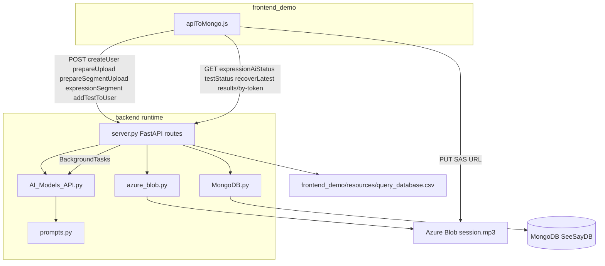

# Backend module map

Entry point: [`server.py`](../server.py) (`uvicorn server:app`).  
Client contract: [`frontend_demo/js/api/apiToMongo.js`](../../frontend_demo/js/api/apiToMongo.js).  
Archived audit/planning: [changes/docs/BACKEND_DEAD_CODE_REPORT.md](../../changes/docs/BACKEND_DEAD_CODE_REPORT.md), [BACKEND_STRUCTURE_RECOMMENDATION.md](../../changes/docs/BACKEND_STRUCTURE_RECOMMENDATION.md).

---

## Request flow (MILI demo)



1. **Login** — `POST /api/createUser` → `MongoDB.add_user` (optional `parentPhone`; `clientInfo.expressionAudioMode` from frontend).
2. **During test (incremental)** — `POST /api/tests/prepareSegmentUpload` → SAS; **PUT** segment blob; `POST /api/tests/expressionSegment` → `MongoDB.upsert_expression_segment` (per question).
3. **Finish (legacy)** — `POST /api/tests/prepareUpload` → SAS; browser **PUT** `session.mp3`; `POST /api/addTestToUser` → save test + queue expression AI from full session.
4. **Finish (incremental)** — client drains segment queue, then `POST /api/addTestToUser` metadata-only; `_ensure_incremental_expression_rows_complete` (retries, `processing_failed` fallback) before impression; optional results SMS when `done`.
5. **Background** — `_run_expression_ai_background` → Gemini per-question scores + Hebrew impression.
6. **Summary poll** — `GET /api/expressionAiStatus?userId&testId`
7. **Public results** — `GET /api/results/by-token?t=...` → `MongoDB.find_test_by_results_token` (410 when expired).
8. **Recover** — `GET /api/testStatus`, `GET /api/tests/recoverLatest` when upload/metadata failed.

---

## Live API routes

| Method | Path | Handler | Frontend |
|--------|------|---------|----------|
| GET | `/` | `home` | Deploy health (optional) |
| POST | `/api/createUser` | `create_user` | `createUser` |
| PATCH | `/api/user/parentPhone` | `patch_user_parent_phone` | (optional) |
| POST | `/api/tests/prepareUpload` | `prepare_upload` | `prepareAudioUpload` (legacy) |
| POST | `/api/tests/prepareSegmentUpload` | `prepare_segment_upload` | `prepareSegmentUpload` (incremental) |
| POST | `/api/tests/expressionSegment` | `expression_segment` | `registerExpressionSegment` (incremental) |
| POST | `/api/addTestToUser` | `add_test` | `updateUserTests` |
| GET | `/api/results/by-token` | `results_by_token` | `getResultsByToken` |
| GET | `/api/expressionAiStatus` | `expression_ai_status` | `getExpressionAiStatus` |
| GET | `/api/testStatus` | `test_status` | `getTestStatus` |
| GET | `/api/tests/recoverLatest` | `recover_latest_test` | `recoverLatestTest` |

Azure upload is **not** a FastAPI route — `putSessionAudioToBlob` PUTs to the SAS URL from `prepareUpload`.

**Removed (Tier 2):** `POST /api/VerifySpeaker` — was not used by `frontend_demo`.

---

## Every file under `backend/`

| Path | Runtime? | Role |
|------|----------|------|
| **`server.py`** | **Yes** | FastAPI app: CORS, routes, Pydantic models, rubric CSV load, test-result parsing, expression AI orchestration (~1.1k lines), `BackgroundTasks` |
| **`MongoDB.py`** | **Yes** | `SeeSayMongoStorage`: users, tests, `expressionAI` updates, daily Gemini quota (`api_usage` collection) |
| **`azure_blob.py`** | **Yes** | SAS upload URLs, blob path `tests/{userId}/{testId}/session.mp3`, existence poll after PUT |
| **`AI_Models_API.py`** | **Yes** | Audio decode/slice (pydub), Gemini expression scoring + impression; `score_expression_with_gemini` (base64 wrapper, kept) |
| **`prompts.py`** | **Yes** | Hebrew/structured prompts for Gemini (imported by `AI_Models_API`) |
| **`requirements.txt`** | Deploy | Python deps (FastAPI, pymongo, google-genai, pydub, …) |
| **`runtime.txt`** | Deploy | Python version pin for Render |
| **`.env`** | Local/deploy | Secrets: `MONGODB_URL`, `DATABASE_NAME`, Azure SAS, `GEMINI_API_KEY`, optional legacy keys — **not committed** |
| **`testRecording.m4a`** | No | Optional local sample audio for manual experiments; not imported by server |
| **`docs/README.md`** | No | Index of backend docs |
| **`docs/BACKEND_MODULE_MAP.md`** | No | This file |
**External data (not in `backend/`):** rubrics loaded from `frontend_demo/resources/query_database.csv` at server startup.

**Not present / removed:** `testings.py`, `Explaintion`, `TTS_Google.py` (Tier 1), VerifySpeaker + Speechmatics (Tier 2), `tools/` dev CLIs (blob smoke, TTS generator).

---

## `server.py` regions (logical modules today)

| Region (approx lines) | Responsibility |
|----------------------|----------------|
| 57–120 | Load `QUESTION_RUBRICS` from CSV |
| 126–308 | Parse `full_array`, timestamps, comprehension context for impression |
| 310–388 | Build pending/aggregate expression AI payloads |
| 430–458 | Pydantic: `CreateUserRequest`, `AddTestRequest`, `PrepareUploadRequest` |
| 460–1095 | HTTP route handlers |
| 587–1060 | `_compute_expression_ai_payload`, background task, stale impression finalize |
| ~1233+ | `_ensure_incremental_expression_rows_complete` (finalize retries, `processing_failed` fallback) |

**Incremental env:** `INCREMENTAL_SCORE_RETRY_ATTEMPTS` (default 5), `INCREMENTAL_SCORE_RETRY_DELAY_SEC` (default 2). See [`README.md`](README.md) and [`../../changes/CHANGES_2026-05-28_28.md`](../../changes/CHANGES_2026-05-28_28.md).

---

## `MongoDB.py` methods (in use)

| Method | Called from |
|--------|-------------|
| `add_user` | `create_user` |
| `get_user_test_by_id` | `add_test`, `test_status` |
| `get_latest_user_test` | `recover_latest_test` |
| `add_test_to_user` | `add_test` |
| `update_test_expression_ai` | Expression AI background |
| `get_test_expression_ai` | `expression_ai_status`, stale checks |
| `upsert_expression_segment` | `expression_segment` (incremental per-question audio) |
| `find_test_by_results_token` | `results_by_token` (SMS public link) |
| `check_and_increment_daily_quota` | Gemini limits in pipeline |

---

## `AI_Models_API.py` symbols used by server

| Symbol | Purpose |
|--------|---------|
| `decode_base64_to_bytes` | Legacy `audioFile64` path |
| `slice_audio_window_bytes` | Per-question audio window |
| `score_expression_with_gemini_bytes` | Per-question Gemini JSON score |
| `summarize_expressive_language_impression_gemini` | Session Hebrew narrative |
| `score_expression_with_gemini` | Base64 wrapper (kept; not called from `server.py` today) |

---

## Still optional (not removed)

| Item | Why kept |
|------|----------|
| `audioFile64` in `add_test` | Frontend fallback + possible non-demo clients |
| `score_expression_with_gemini` | Requested keep |
| `openAI_client` in `AI_Models_API` | Reserved; no active route uses OpenAI today |
| Monolith `server.py` | Structure split is a separate approved phase |

---

## Run locally

```bash
cd backend
.\.venv\Scripts\activate
uvicorn server:app --reload --port 8001
```

Point `frontend_demo` at the same host/port (or production `seeandsay-backend.onrender.com`).
