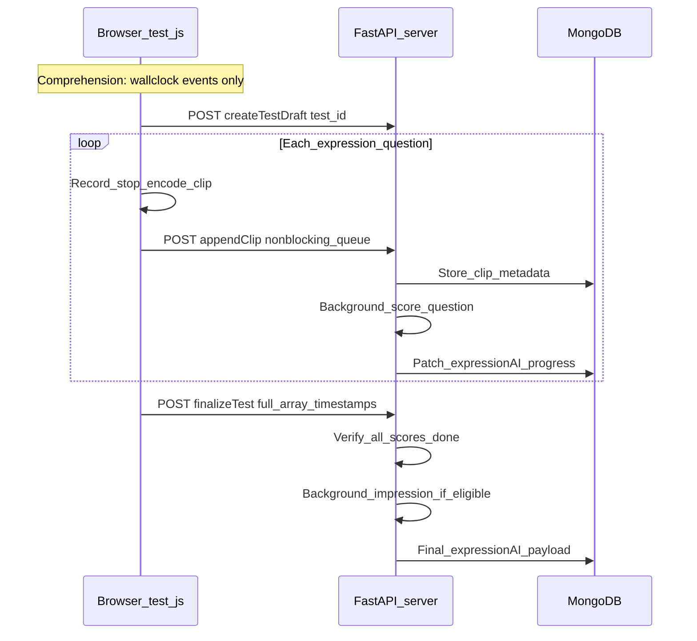

# Expression-only recording + incremental AI scoring

## Current behavior (baseline)

- **Recording:** `frontend_demo/recording.js` — one `MediaRecorder` from early test flow through `completeSession`; `frontend_demo/test.js` stops recorder, waits for MP3, `FileReader.readAsDataURL`, then `frontend_demo/apiToMongo.js` `updateUserTests` → `backend/server.py` `POST /api/addTestToUser` with **`audioFile64`** + `timestamps` + `full_array`.
- **Timestamps:** `markQuestionStart` uses elapsed ms since `recordingStartTime` (`getElapsedMs`). Comprehension marks at question load in `test.js`; expression marks when expression timer arms (`markExpressionTimestampAndArm`).
- **AI:** `server.py` `_compute_expression_ai_payload` decodes one `audio_file64`, slices per expression window from timestamps, runs per-question Gemini, then random up to 10 clips for `summarize_expressive_language_impression_gemini` in `AI_Models_API.py`.
- **Download:** `test.js` `downloadRecording` + completion UI; `i18n.js` `test.done.downloadRecording`.

## Target behavior

1. **No continuous recording during comprehension** — expression session audio starts at the first expression question (aligned with timer/reading semantics today).
2. **Per-expression-question audio** — bounded memory: encode → upload → drop blob; optional upload queue (concurrency 1–2), non-blocking for the child.
3. **Timestamps for all questions** — decouple question event times from “offset inside expression-only blob”: session timeline origin (e.g. wall clock at test start) for comprehension + expression events; clips are self-contained for Gemini (no slice from one giant decode).
4. **Incremental 0/1/2 scoring** — on each clip upload, server background task scores that question only; Mongo `expressionAI` updated progressively (`update_test_expression_ai` pattern).
5. **Finalize at end** — lightweight call: `full_array`, counts, `timestamps`, `test_id`; no monolithic `audioFile64`. Expressive-language impression runs only after all per-question rows are terminal.
6. **Storage** — replace single `audioFile64` with **`expressionAudioClips`** (array of per-question payloads, **inline** — same spirit as today’s one big `audioFile64`). Expression question count is **bounded** (product constant, e.g. **≤ ~35**), each clip **≤ ~30 s** MP3, and production has already stored **longer single-session** audio without document-size issues — so **inline storage is the expected default**; GridFS / external blob remains a **documented rare fallback** only if a future change (bitrate, extra embedded payloads) ever approaches Mongo’s **16 MB per-document** hard cap.

## Glossary (storage / Mongo)

- **BSON** — MongoDB’s binary document encoding. **One document** (e.g. one element inside `users.tests[]`) has a **hard max size of 16 MB** including all fields (`fullArray`, `expressionAI`, embedded audio strings, etc.). This is a **platform rule**, not something you hit in normal operation so far.
- **`audioFile64` (today)** — One long text field: session audio encoded as **base64** (often with a `data:...;base64,` prefix). Base64 is **not** a special audio format; it is **encoding** of bytes as ASCII for JSON. It grows size by **~33%** vs raw MP3 bytes.
- **`expressionAudioClips` (planned)** — Array of per-question entries (e.g. question id + MP3 bytes as base64 or `BinData`). Same idea as today, but **split by question**. With **≤ ~35** clips of **≤ ~30 s** each at typical speech bitrates, total embedded audio is **roughly comparable to** (and often **not larger than**) the **single full-session** `audioFile64` already stored in production without hitting document limits — so **practical expectation: stay well under 16 MB** unless other fields grow dramatically.
- **GridFS** — **Not** an audio format. It is **MongoDB’s built-in pattern** for storing a large file as many **chunks** in separate collections (`fs.files` / `fs.chunks`) while the main document holds only **file id + metadata**. **Unlikely to be required** for v1 given **≤ ~35** expression clips × 30s cap; keep as **optional** if monitoring ever shows a document approaching the cap.

### Backward compatibility and operations (no manual DB work for rollout)

- **Recommended approach:** keep **existing Mongo documents unchanged**. Old tests keep **`audioFile64`** as they are today. **New** tests, written after the feature ships, store **`expressionAudioClips`** (and typically **omit** a monolithic `audioFile64` or leave it null). **No bulk migration**, **no manual edits** in Atlas or shell are required for backward compatibility — only **application code** branches on **which fields exist** when reading or re-processing a test.
- **Optional later:** a scripted migration (convert old `audioFile64` → synthetic clips or leave as-is forever) is a **separate product decision**, not part of the initial rollout.

### Per-question audio: how each question is stored (default vs fallback)

- **Primary (planned v1):** each expression question’s MP3 is stored **inside the same test subdocument** as an element of **`expressionAudioClips`** — e.g. `{ questionNumber, audioBase64 }` or BSON `BinData` — the **same family** as today’s single `audioFile64` field, just **split per question**. This matches **free-tier / M0** setups: no extra paid services, no mandatory GridFS wiring.
- **GridFS (or external blob URL):** **not** the default per-question mechanism. It is a **rare fallback** reserved for the unlikely case that the **entire** `tests[]` document approaches Mongo’s **16 MB** hard cap (e.g. future much larger `expressionAI` payloads, higher bitrate, or many more embedded assets). **Given ≤ ~35 expression clips × ≤ ~30 s** and current production experience with a **single long** `audioFile64`, **v1 inline-only on free tier is the expected outcome** — no GridFS dependency for rollout.
- **Operations note:** choosing GridFS later is still **code-driven** (write path decides where bytes go); admins should not have to hand-edit documents for normal operation.

## Product constraints (agreed refinements)

### Expression clip time window (matches current intent, capped at 30s)

- **t = 0 for the clip** must match **today’s timestamp semantics**: the answer window starts when **initial question reading audio has finished** and the expression flow arms (same moment you already record via `markExpressionTimestampAndArm` / post-reading hooks in `test.js`) — **not** when the user **navigates onto** the question if that happens earlier than “reading ended.”
- **End of the answer window** (what gets encoded into the clip): the **earlier** of (a) user advances / submits traffic and moves on, or (b) **30 seconds of audio after that post-reading start** — aligned with `EXPRESSION_EVAL_DELAY_MS` / server cap policy.
- **Popup latency does not extend the clip:** if the evaluation UI opens at 30s and the parent answers **20 seconds later**, the **stored and scored audio remains only the first 30 seconds** from the post-reading start (no tail). UX timers can stay as today; **encode/finalize clip uses the 30s cap** so backend behavior matches “first 30 seconds only.”

### No comprehension audio accumulation (hard requirement)

- During **comprehension** (`הבנה`), the app must **not** run `MediaRecorder` in a way that buffers speech to RAM/disk. Long comprehension sessions must not grow memory from audio chunks.
- **Implication:** do **not** reuse “start recorder early and pause” as a substitute — pausing still ties lifecycle to one recorder and risks confusion. Prefer: **no session expression `MediaRecorder` until the first expression question**; only then attach `MediaRecorder` to the mic (or swap to a fresh recorder) for the bounded clip.
- **Reading / verification** may still use a **separate**, short-lived capture path as today; that path must be **independent** from the expression clip pipeline and must **stop/release** before long comprehension so no dual recording.
- If `getUserMedia` must stay open for UX reasons during comprehension, the stream must **not** feed `MediaRecorder.ondataavailable` until expression — verify in implementation review so no hidden buffering.

### Upload backlog vs model scoring (non-blocking)

- Clips may be **uploaded faster** than Gemini finishes question 1; that is expected.
- **Client:** never `await` scoring; only await **small upload ACK** if needed, with a **bounded upload queue** (concurrency 1–2) so the network does not stall the UI. Drops large blobs from memory right after enqueue.
- **Server:** treat each clip as an **independent work item** (queue or `BackgroundTasks` per clip). Persist clip first, then score; idempotent updates by `question_number`. Ordering of completion can differ from upload order.
- **No user-visible “lag”** from backlog: gameplay and summary shell load must not block on “score N before score N+1”; summary may show **pending** rows until each score lands.

### Resume vs refresh (documented product behavior)

- **Not device-based** — behavior is driven by **stored test shape** and **session state**, never by “device type” branching (avoids fragile, duplicated logic).
- **Resume (same tab, user returns to an in-progress test, no full page reload):**
  - **Current expression question:** user must still be able to **listen** to the in-progress clip where the product already offers playback (same as today: keep a **blob URL** or in-memory blob for the **active** question until that clip is finalized/uploaded and it is safe to revoke).
  - **Timing:** pause/resume during an expression question must keep **wall-clock marks** and **clip-relative timing** consistent with today’s pause behavior for the session (apply the same product rules to the **segment** recorder: paused time does not extend the 30s scoring window, or document explicitly if parity requires otherwise).
  - **Completed questions:** after server **ACK** for a clip, drop local heavy bytes for that question to cap RAM; server is source of truth for replay on summary if needed.
- **Refresh (full reload / crash):**
  - **v1 acceptable:** unsent clips may be lost (same class of risk as any unsynced work); show honest UX if detected.
  - **v1+ optional hardening:** **IndexedDB** outbox keyed by `testId` + `questionNumber` for **pending** clip blobs + small metadata in `localStorage`; on next load, flush uploads then delete — improves refresh recovery without stuffing `localStorage` with base64 (quota-safe).
  - **Metadata-only `localStorage`** (no large blobs): fine for flags like `lastUploadedQuestion`, `draftTestId`.

### Summary screen: AI status / progress

- Keep and **extend** the existing pattern (`expressionAI.meta.progress` phases / `expressionAiStatus` polling in `test.js`) so the completion UI shows:
  - **How many** expression questions have a **terminal** per-question row (done / failed / skipped with reason),
  - **How many** remain pending,
  - Optional **phase** label (e.g. uploading vs scoring vs impression).
- Final **expressive-language impression** remains gated until **all** per-question 0/1/2 rows are settled, then show impression block as today.

## Sequence (high level)

## Implementation phases

### Phase A — Data model and APIs (backend + Mongo)

- Early **`test_id`**: e.g. `POST /api/createTestDraft` returning `test_id`, aligned with `expressionAiStatus` / `update_test_expression_ai`.
- **`POST /api/tests/{test_id}/expressionClip`** — multipart or compact audio + `question_number`, `headlight_result`; optional **`clip_window_sec`** or server-trust max 30s re-encode trim; idempotent by question.
- **`POST /api/tests/{test_id}/finalize`** — `full_array`, scores, `timestamps`, `childGender`; no monolithic audio.
- Background per-clip scoring (**queue-safe**, order-independent merges into `expressionAI`); impression gated on all scores done.
- Extend **`expressionAI.meta.progress`** (and/or per-row status) for summary UI: `processed_questions`, `total_questions`, `phase`, optional `uploads_received` vs `scores_done` if useful.
- **Legacy tests in Mongo (read path only):** many rows already have **`audioFile64`** only. New rows use **`expressionAudioClips`** (and omit or null the monolithic field). **Detection rule:** branch on **which fields exist on that test document** — `if audioFile64 and not clips → legacy pipeline`; `elif clips → new pipeline`. **Not** by device model / browser sniffing (that would be brittle and is **out of scope**). **No manual DB changes** required: old rows stay valid forever unless you opt into a migration. If the team ever wants a **single** code path only, that implies a **data migration** of old tests or dropping support for re-scoring old blobs — call that out explicitly before doing it.

### Phase B — Frontend recording refactor

- `recording.js`: **session timeline clock** for `markQuestionStart` / `markQuestionEnd` for **all** questions **without** any `MediaRecorder` during comprehension; **expression-only** `MediaRecorder` starting at first `הבעה`, with explicit **stop** at advance or **30s cap** from post-reading arm (whichever comes first); clip bytes = that window only.
- `recording.js`: per-question **finalize** produces one bounded MP3 (or chosen codec) blob for upload; release mic or stop recorder after each clip per design (vs one long expression session — pick one and document memory tradeoff).
- `test.js`: align arm/stop with existing expression timer / reading-ended hooks; **do not** start session recording on voice screen for the purpose of expression clips.
- `test.js`: on traffic submit / advance, close clip, enqueue upload (non-blocking), `markQuestionEnd` on **wall-clock timeline**.
- Resume/refresh: follow **“Resume vs refresh”** section above (IndexedDB optional; in-tab resume keeps listen + timing parity).

### Phase C — `completeSession` and verification merge

- Remove giant `readAsDataURL` for session audio; `finalizeTest` + optional drain of upload queue with timeout UX only if needed.
- Redefine `combineAudioBlobs` (verification + session) per product decision.

### Phase D — Remove download recording

- Remove handler, button, and unused i18n; `app.js` `download` flag if applicable.

### Phase E — Testing and rollout

- Mic skipped, single/multi clips, out-of-order, duplicate question id, finalize timeout, pause/resume, adaptive skip-to-expression.
- **Backend down at session start:** `createTestDraft` fails → no `draftTestId` → no `expressionClip` traffic; finish must not spin on monolithic MP3 unless a continuous session recorder was actually live; user-visible copy should say clips/AI were skipped, not “converting recording.”

## Risks (summary)

| Risk | Mitigation |
|------|------------|
| BSON 16MB | **Low priority in practice:** bounded expression count (~35) × 30s clips + existing full-session success implies inline docs stay safe; **monitor** doc size in staging; **GridFS** only if a future regression approaches the hard cap |
| Lost clip | Retries, finalize lists missing clips, `missing_audio` rows |
| Timeline vs clip | Separate global event JSON from per-clip bytes |
| Impression race | Gate impression until all per-question scores terminal |
| Mic ownership | Document reading verify vs expression recorder exclusivity |
| Accidental comprehension buffering | Code review: no `MediaRecorder` until first expression; no `ondataavailable` without explicit record segment |
| Upload faster than Gemini | Server queue + idempotent row merge; UI shows pending counts, never blocks gameplay on score backlog |

## Files likely touched (non-exhaustive)

- `frontend_demo/recording.js`, `frontend_demo/mp3-encode-worker.js`, `test.js`, `apiToMongo.js`, `welcome.js`, `app.js`, `i18n.js`
- `backend/server.py`, `backend/MongoDB.py`, `backend/AI_Models_API.py` (if impression assembly changes)
- `changes/CHANGES_2026-05-14_15-05.md` (running log for this effort)

## Execution todos (tracking)

1. Design draft test + expressionClip + finalize APIs; Mongo schema — **inline `expressionAudioClips` only for v1** (GridFS reserved for unlikely size regression; bounded ~35×30s clips).
2. Decouple timeline marks from MediaRecorder clock; **clip = post-reading start → min(advance, 30s)**; `markQuestionEnd` on wall-clock timeline.
3. Expression-only capture: **no recorder during comprehension**; pause/resume only within expression segment; MP3 without full-session buffer.
4. Client upload queue (bounded concurrency, retries, finalize drain) — **never await** server scoring on UI thread. **Client (v1):** `postExpressionClipWithRetry` retries transient **network** / **HTTP 408 / 425 / 429 / 500 / 502 / 503 / 504**; **`runWithExpressionClipConcurrency`** caps parallel **`expressionClip`** POSTs (default **2**, `window.SEEANDSAY_EXPRESSION_CLIP_MAX_PARALLEL`); **`finalizeUserTestsWithRetry`** (default **3** attempts) after clip drain in `completeSession`. **Optional later:** stronger global upload backpressure if product needs it.
5. Server incremental scoring + **order-independent** merge into `expressionAI`; handle upload backlog vs Gemini; impression gate.
6. **Summary progress UX:** extend `expressionAiStatus` / meta.progress for processed vs remaining + phase labels.
7. Refactor `completeSession`; verification merge policy; last-question paths.
8. Remove download recording UI + i18n.
9. QA matrix: skip mic, refresh, adaptive flow, quota, finalize timeout, **long comprehension + no RAM growth**, **30s cap with late traffic answer**, upload faster than first score completes, **resume mid-expression (listen + timing parity)**.
10. **Done (v1) — client 30s auto-stop:** `recording.js` stops the expression-segment `MediaRecorder` after **active** recording time reaches the same default cap as server trim (**30s**, override `window.SEEANDSAY_EXPRESSION_CLIP_MAX_SECONDS`); pause subtracts elapsed time so the scoring window does not extend. **`stopExpressionClipRecording`** is idempotent (shared in-flight promise) so timer + traffic cannot double-stop.
11. **Draft / API failure UX (done for v1):** when **`createTestDraft`** fails (`Failed to fetch`, 4xx) while the question timeline is live and the mic is on, or when **`postExpressionClip`** fails mid-test (network / HTTP error so the clip never reaches Mongo), show a **parent-only fullscreen message** (localized: return home, single CTA to `onHome`) — no technical detail, no in-flow retry; cancel any pending Q1 `markQuestionStart` timeout on draft failure; suppress the AFK overlay while this screen is up; clear **`draftTestId`** after a failed clip POST so the tab does not keep hammering a missing test row; never enter the legacy MP3 conversion poll unless `SessionRecorder.isMediaRecorderLive()` was true for continuous capture. **Follow-up:** optional retry draft / retry clip remains a later enhancement if product wants it.
12. **Developer visibility:** each successful `postExpressionClip` should log one line (URL, `questionNumber`, payload size). **No** lines for a run usually means **no `draftTestId`** (draft never created), not a silent per-question failure.

## Known issues and observability (operational notes)

### Question audio “stutters” or restarts briefly after a clip ends

**Plausible cause:** expression clip stop still runs **MP3 encoding** (`decodeAudioData` + lame). Historically this ran on the **main thread** and could block the same thread that drives the next question’s `HTMLAudioElement`. **Mitigation shipped:** **`decodeAudioData`** runs on the **main thread** (where every browser supports it); **mono PCM** is transferred into **`mp3-encode-worker.js`**, which runs **lamejs** only. If the worker is unavailable, the same **decode → lame** path runs entirely on the main thread. **Ordering:** **`yieldForQuestionAudioHandoff()`** + **`yieldBeforeMp3Encode()`** before starting work so the next question’s **`<audio>`** can start before decode/file I/O. **Residual risk:** **`decodeAudioData`** can still briefly contend with playback on slow devices; **todo 4** (upload queue / retries) reduces Finish-time contention without changing clip encode.

### Summary progress jumped (e.g. 5/10 → 0/10)

**Cause:** `finalize_merge` used to emit `processed_questions=0` at the start of finalize while incremental clip scoring had already advanced the counter — the UI read the new phase and showed **0/total**. **Fix:** initialize finalize progress from **already scored rows** and emit `processed_questions = min(count_scored_rows(snapshot), total)` on each step so the counter does not reset backward.

### When does Gemini run relative to “Finish”?

1. **On each `POST .../expressionClip`:** the server appends the clip and queues **`_run_expression_clip_score_background`** — that can call Gemini **per clip** as uploads arrive (does not wait for Finish).
2. **On `POST .../finalizeTest`:** the handler persists the finalized test row, returns **`expression_ai` from Mongo immediately** (often still `pending`), then queues **`_run_finalize_expression_ai_from_clips_background`** — merge, any missing per-question scores, then **expressive_language_impression**. The browser **must poll** `/api/expressionAiStatus` (or refresh) to see `done` and narrative text.
3. **Logs (uvicorn INFO):** `expressionClip accepted … trim_cap_s=…` when a clip is stored; **`Gemini expression score: question=…`** immediately before the per-question model call; **`Gemini expressive_language_impression (finalize_merge): …`** before the impression call. If those lines never appear, the code path did not reach the model (quota, missing rubric, empty audio, or exception earlier).

### Stored clip length looks like ~20s, not 30s

**Server cap** is **`GEMINI_MAX_SEGMENT_SECONDS`** (default **30**; override with env). The backend **raises any value below 30 to 30** so it stays aligned with the **30s** expression timer in `test.js` (older `.env` files often had **20**). On startup the server logs the active cap. **Stored MP3 can still be shorter than the cap** when the child spoke for less time or the client blob was shorter. **Do not infer duration from base64 character count.**

### “No AI feedback” despite `expressionClip` in the browser console

Check in order: **`finalizeUserTestsWithRetry`** / **`finalizeUserTests`** returned **null** (Network tab on `finalizeTest` — 4xx body); **`lastCompletedTestId` unset** so polling never starts; **`expression_ai.expressive_language_impression`** still `skipped` (`no_eligible_samples`, `quota_exceeded`, or model failure); or **per_question** rows present but UI tab not showing them. Client logs **`finalizeTest` response `expression_ai.status`** on success. **While clip uploads drain after Finish**, the summary screen keeps **`lastCompletedTestId`** on the draft **`test_id`** and polls **`expressionAiStatus`** every **2s** so incremental scores can appear before **`finalizeTest`** returns.
