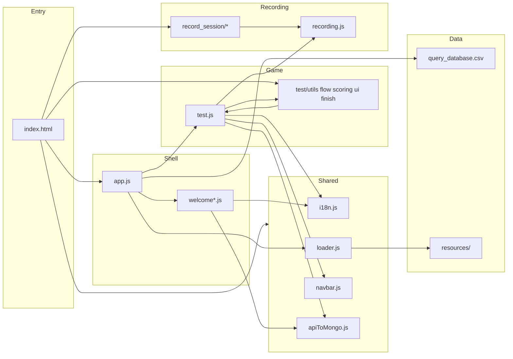

# MILI — Web demo (`frontend_demo/`)

**MILI** (מיל"י) is the browser game parents and children use: onboarding, age-tailored questions, session audio recording, and a results screen with optional AI feedback.

This folder is the **deployable frontend**. There is no build step — the browser loads scripts listed in [`index.html`](index.html). The git repo is still named `seeandsay`. JavaScript globals use the **`Mili*`** prefix (`MiliTestModules`, `MiliTestSession`, …). **`localStorage` / `sessionStorage` keys** still use the `seeandsay*` prefix so existing saved progress keeps working.

| Also in this repo | Role |
|-------------------|------|
| [`../backend/`](../backend/) | FastAPI API, MongoDB, blob upload, transcription / scoring jobs |
| [`../changes/`](../changes/) | Engineering changelog (`CHANGES_*.md`) |
| [`docs/`](docs/) | Deeper references: module map, dead-code notes |

---

## Table of contents

1. [Run locally](#run-locally)
2. [Read this first](#read-this-first)
3. [Application flow](#application-flow)
4. [How components connect](#how-components-connect)
5. [Folder and file guide](#folder-and-file-guide)
6. [The test game (`js/test/`)](#the-test-game-jstest)
7. [Session recording](#session-recording)
8. [Backend API](#backend-api)
9. [Rules when you change code](#rules-when-you-change-code)

---

## Run locally

From the **repository root**:

```bash
python -m http.server 8000
```

Open **`http://localhost:8000/frontend_demo/`** (trailing slash matters for relative paths).

Start the API separately (default **`http://127.0.0.1:8001`**). The client in `js/api/apiToMongo.js` picks port 8001 when the page is served from 8000 on localhost.

---

## Read this first

| If you want to… | Open |
|-----------------|------|
| See what loads and in what order | [`index.html`](index.html) → `files` array (bottom `<script>` block) |
| Understand routing (home vs game) | [`js/app/app.js`](js/app/app.js) → `App()` |
| Follow onboarding screens | [`js/app/welcome.js`](js/app/welcome.js) + `welcomeScreens.js` / `welcomeLogin.js` |
| Follow the game itself | [`js/test/test.js`](js/test/test.js) (orchestrator) |
| See HTTP calls to the server | [`js/api/apiToMongo.js`](js/api/apiToMongo.js) |
| Question data and assets | [`resources/query_database.csv`](resources/query_database.csv), [`resources/test_assets/`](resources/test_assets/) |

**Load order is fragile.** Scripts register globals (`SessionRecorder`, `MiliTestModules`, …) before later files use them. Do not reorder `index.html` without checking dependencies ([`docs/TEST_MODULE_MAP.md`](docs/TEST_MODULE_MAP.md)).

---

## Application flow

High-level path from opening the URL to finishing a game:

```
index.html
    → loads CDN (React, Babel, PapaParse, lamejs) + all app scripts
    → app.js mounts App()
         │
         ├─ page === "home"  →  Welcome (onboarding)
         │       screen1 (intro)
         │       → screen2_login (child profile, consents, mic) → createUser API
         │       → screen1_video (avatar intro)
         │       → screen3 (how it works) → setPage("test")
         │
         └─ page === "test"   →  Test (game)
                 → optional: age invalid / mic gate / compr & exp intro videos
                 → question loop (comprehension + expression)
                 → session complete → upload audio + results → summary UI
                 → user can go home; progress may resume from localStorage
```

**Persistence:** Most game state lives in `localStorage` via `usePersistentState` in `app.js` and `test.js`. A run’s backend id is `testId` in `sessionStorage` (`seeandsayPendingTestId`), managed by `MiliTestSession`.

**Resume:** `MiliTestRun` (in `app.js`) detects an in-progress run before login or when starting from home. Welcome can show “continue vs new game”; the test can restore index and scores.

---

## How components connect



| From | To | Connection |
|------|-----|------------|
| `app.js` | `welcome.js` | Renders when `page === "home"`; passes `setPage`, `onRequestStartTest` |
| `app.js` | `test.js` | Renders when `page === "test"`; passes `allQuestions` from CSV |
| `app.js` | `apiToMongo.js` | Indirect via Welcome login and Test finish |
| `welcomeLogin.js` | Backend | `createUser()` after profile + mic OK |
| `test.js` | `MiliTestModules.*` | Lazy `createX(getCtx)` factories; ctx refs filled each render |
| `test.js` | `SessionRecorder` | Start/pause recording; question timestamps |
| `testSessionFinish.js` | Backend | `prepareAudioUpload` → blob PUT → `updateUserTests` |
| `testSummaryRender.js` | Backend | Polls `getExpressionAiStatus` for expression feedback |
| All UI strings | `i18n.js` | `I18N.t(key)`; `?lang=en` on URL |

---

## Folder and file guide

Paths are relative to **`frontend_demo/`** (where `index.html` lives). Asset URLs in JS (e.g. `resources/...`) are **not** relative to `js/`.

### Root (entry and wiring)

| File / folder | Role |
|---------------|------|
| **`index.html`** | Single entry: meta, CSS inject, **script load list** (public API) |
| **`expressionTiming.js`** | Sets `MILI_EXPRESSION_ANSWER_MS` (20s expression window) |
| **`recording.js`** | Builds global **`SessionRecorder`** from `js/record_session/*` (facade only; keeps one obvious recorder entry next to `index.html`) |
| **`package.json`** | Deploy placeholder for Render; no npm build |
| **`css/`** | Design tokens (`colors.css`), shell (`layout.css`), hub (`styles.css`), screen CSS under `screens/` |
| **`resources/`** | `query_database.csv`, per-question images (`test_assets/`), question audio, avatar videos |
| **`docs/`** | Maintainer docs (module map, structure snapshot, dead-code report) |
| **`tools/`** | Optional Node scripts to re-extract code from `test.js` into modules — **not loaded at runtime** |

### `js/core/` — shared utilities

| File | Global | Role |
|------|--------|------|
| `i18n.js` | `I18N` | Hebrew / English copy |
| `loader.js` | `ImageLoader` | Preload question images after CSV load |

### `js/api/` — backend client

| File | Global | Role |
|------|--------|------|
| `apiToMongo.js` | `MiliTestSession` + fetch helpers | Base URL, `testId` lifecycle, user create, upload, results, AI status |

### `js/components/` — reusable UI

| File | Global | Role |
|------|--------|------|
| `navbar.js` | `AppNavbar` | Header: language, reset, home; pause / finish during test |
| `help.js` | — | Help content (legacy; app redirects `help` page to home) |

### `js/app/` — shell and onboarding

| File | Role |
|------|------|
| `app.js` | Root `App()`: CSV load, `page` routing, `MiliTestRun`, mounts Welcome / Test |
| `welcome.js` | Onboarding orchestrator (nav, screen order, video autoplay) |
| `welcomeScreens.js` | Intro, intro video, “how it works”, start game button |
| `welcomeLogin.js` | Login form, validation, mic permission, `createUser` |
| `welcomeShared.js` | `MiliWelcomeModules`: storage helpers, resume/tips modals |

### `js/record_session/` — recorder implementation

| File | Role |
|------|------|
| `recordingTimestamps.js` | Question marks, pause-aware clock, export text |
| `recordingCapture.js` | `MediaRecorder`, pause/resume, 12:30 session cap |
| `recordingEncode.js` | MP3 encode (lamejs), final blob for upload |

Loaded **before** root `recording.js`, which exposes the unified API the game uses.

### `js/test/` — game (see next section)

| File | Role |
|------|------|
| **`test.js`** | Orchestrator: state, effects, ctx wiring, render routing (~3k lines) |
| `utils/` | Pure helpers (age, question types, avatar video paths, constants) |
| `flow/` | Timers, mic intro, start screens, load question / index |
| `scoring/` | Comprehension tap scoring and advance rules |
| `ui/` | Pause/AFK, overlays, question layout, session-complete screen |
| `finish/` | End session, upload pipeline, expression AI polling |

---

## The test game (`js/test/`)

`test.js` is the **coordinator**. Feature code lives in subfolders but talks through **`window.MiliTestModules`**:

- Modules export `createSomething(getCtx)` (or plain functions on `MiliTestModules`).
- `test.js` holds React state and assigns **`somethingCtxRef.current = { … }`** before render (including early returns for intro-only screens).

**Render order inside `Test`:**

1. `tryRenderStartScreen()` — age invalid, expression mic gate, comprehension/expression intro videos, “preparing recording”
2. If `sessionCompleted` → summary screen (`testSummaryRender.js`)
3. Else main play UI — navbar, question section, bottom bar, overlays (`testQuestionRender`, `testOverlays`, …)

**One question (simplified):**

1. `loadQuestion` sets audio, images, resets per-question UI.
2. **Comprehension** — taps scored in `testScoring.js`; auto-advance / confetti.
3. **Expression** — 20s timer (`testExpressionTimers.js`); parent rates via traffic overlay (`testOverlays.js`).
4. **Pause / AFK** — `testPauseAfk.js` + `SessionRecorder` pause.
5. **Finish** — early-finish dialog or last question → `completeSession` in `testSessionFinish.js`.

For line-level module ownership and QA checklist, see [`docs/TEST_MODULE_MAP.md`](docs/TEST_MODULE_MAP.md).

---

## Session recording

| Layer | What it does |
|-------|----------------|
| `record_session/*` | Implementation (capture, timestamps, encode) |
| `recording.js` | Facade → **`SessionRecorder`** global |
| `test.js` + modules | `startContinuousRecording`, `markQuestionStart` / `markQuestionEnd`, pause with navbar |

On finish, `testSessionFinish.js` waits for the MP3 blob, uploads to Azure via SAS from the backend, then sends scores and timestamp text with `updateUserTests`.

---

## Backend API

Client: [`js/api/apiToMongo.js`](js/api/apiToMongo.js). Server: [`../backend/server.py`](../backend/server.py).

| Step | Client function | Endpoint |
|------|-----------------|----------|
| After login | `createUser` | `POST /api/createUser` |
| End of game (1) | `prepareAudioUpload` | `POST /api/tests/prepareUpload` |
| End of game (2) | `putSessionAudioToBlob` | `PUT` Azure SAS URL |
| End of game (3) | `updateUserTests` | `POST /api/addTestToUser` |
| Summary screen | `getExpressionAiStatus` | `GET /api/expressionAiStatus` |

**`testId`:** New game → `MiliTestSession.beginNewTestSessionIdentity()`. Resume → `ensurePendingTestId()` keeps the same id.

**Demo note:** `USE_TEMP_RANDOM_BACKEND_USER_ID` maps demo string ids to a random integer per tab until the API accepts string `userId`s.

Transcription and expression scoring run on the server after upload; this folder only polls status for the summary UI.

---

## Rules when you change code

1. **Script paths** — Moving a file requires updating the `files` array in `index.html`.
2. **Asset paths** — Keep `resources/…` and `css/…` relative to `frontend_demo/`, not `js/`.
3. **Load order** — Factories must load before `test.js`; `record_session` before `recording.js`; `recording.js` before test modules that use `SessionRecorder`.
4. **Ctx refs** — Bind `*CtxRef.current` before any early `return` in `Test` render.
5. **Behavior / UX changes** — Log in [`../changes/`](../changes/) per project convention; do not treat this README as the changelog.

---

## Further reading

| Document | Contents |
|----------|----------|
| [`docs/STRUCTURE.md`](docs/STRUCTURE.md) | Short directory tree + global namespace table |
| [`docs/TEST_MODULE_MAP.md`](docs/TEST_MODULE_MAP.md) | Per-module responsibilities and regression QA matrix |
| [`docs/DEAD_CODE_REPORT.md`](docs/DEAD_CODE_REPORT.md) | Removed / do-not-delete notes from refactors |
| [`../changes/docs/FRONTEND_DEMO_CHANGELOG.md`](../changes/docs/FRONTEND_DEMO_CHANGELOG.md) | Historical product UX notes |
